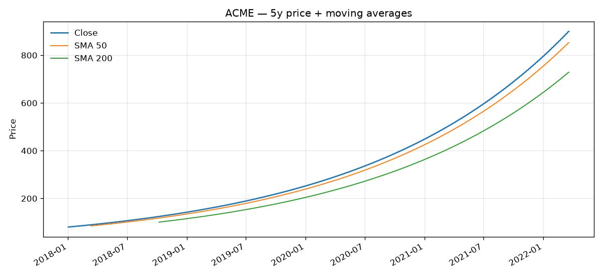
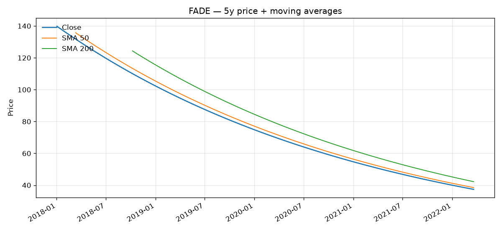
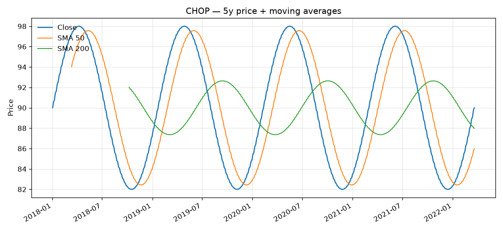

> **Note:** This checked-in sample is generated from *synthetic* OHLCV and fundamentals (`python examples/generate_sample.py`), not live market data. Run `python -m stock_analyzer AAPL TSLA --periods 1mo,3mo,6mo,1y,5y` for a live Yahoo report.

# Stock trend + fundamentals report

Generated: 2026-09-01 14:56 UTC  
Data source: Yahoo Finance via yfinance (no API key)

> **Disclaimer:** This tool is for educational and informational analysis only. It is not investment advice, a recommendation to buy or sell any security, or a substitute for independent research and professional judgment. Market data may be delayed, incomplete, or inaccurate. Past performance does not indicate future results. You are solely responsible for your investment decisions.

## Cross-ticker scoreboard

| Ticker | 1mo | 3mo | 6mo | 1y  | 5y  | Quality       | Headline                                                                    |
| ------ | --- | --- | --- | --- | --- | ------------- | --------------------------------------------------------------------------- |
| ACME   | +59 | +71 | +80 | +88 | +90 | Strong (82)   | ACME: strong uptrend across requested windows with improving margins        |
| FADE   | -39 | -58 | -64 | -74 | -73 | Stressed (15) | FADE: strong downtrend across requested windows with deteriorating earnings |
| CHOP   | +57 | +62 | +31 | +4  | +17 | —             | CHOP: uptrend across requested windows                                      |

## Method

```
Trend score method (per ticker, per period)
-------------------------------------------
Each period is scored from -100 (strong downtrend) to +100 (strong uptrend).
The headline score is a weighted blend of five components (weights renormalized
if a component cannot be computed, e.g. a new listing with no SMA200):

  1. Return (30%) — total close-to-close return over the window, compressed with
     tanh(return / period_scale) so a typical "strong" move for that horizon sits
     near +/-100. Scales: 1mo ~12%, 3mo ~20%, 6mo ~28%, 1y ~35%, 5y ~120%.
  2. MA alignment (25%) — end-of-window close vs SMA_fast vs SMA_slow.
     Price > fast > slow is fully bullish; the inverse is fully bearish.
  3. MA slope (20%) — linear-regression slope of the fast SMA across the window,
     expressed as implied percent change, then tanh-scaled like returns.
  4. Market structure (15%) — swing highs/lows (local extrema). Higher-highs and
     higher-lows score bullish; lower-highs and lower-lows score bearish.
     A nearly monotonic move is treated as implicit structure in that direction.
  5. Momentum (10%) — supporting context only: MACD histogram sign/magnitude and
     RSI(14). RSI>70 is tagged overbought; RSI<30 oversold. This component cannot
     by itself produce a "strong" label.

Horizons: 1mo/3mo = short-term, 6mo/1y = medium-term, 2y/5y/10y = long-term.
Short, medium, and long scores are allowed to disagree; the report calls that out.

Fundamentals
------------
Pulled from Yahoo Finance via yfinance (no API key): revenue and EPS/net-income
trend, gross/operating/profit margins, PE/PS/PB and EV/EBITDA when present,
debt/equity, free cash flow, ROE/ROA. Quality is a 0–100 heuristic (growth,
profitability, leverage, cash generation, trend of earnings and margins) — not
a valuation target or buy/sell rating.

Synthesis
---------
A short qualitative paragraph compares price trend vs fundamental direction,
e.g. "uptrend with improving margins" vs "price rising while earnings deteriorate".
```

## ACME

**ACME: strong uptrend across requested windows with improving margins**

ACME screens as **strong uptrend** overall (blend +80). Period detail: 1mo strong uptrend (+59, return +4.5%), 3mo strong uptrend (+71, return +14.6%), 6mo strong uptrend (+80, return +31.7%), 1y strong uptrend (+88, return +73.7%), 5y strong uptrend (+90, return +1022.1%). Timeframes agree on an uptrend: short-term strong uptrend (+65), medium-term strong uptrend (+84), long-term strong uptrend (+90). Swing structure on 5y: mostly advancing (few swings). RSI(100) on the shortest window is overbought — momentum is stretched.

Acme Growth Corp (Technology): Fundamental quality screens **strong** (82/100). Growth: revenue YoY +20.0%; multi-year revenue CAGR +22.5%; earnings YoY +33.3%; EPS/net-income trend improving; margin trend improving. Valuation snapshot: trailing P/E 22.0, forward P/E 18.0, P/S 5.0, P/B 6.0, EV/EBITDA 14.0. Profitability & balance sheet: operating margin 30.0%; profit margin 20.0%; ROE 28.0%; ROA 12.0%; debt/equity 0.40x; FCF 20.00 (improving).

Read-through: **uptrend with supportive fundamentals** (growth and/or margins not working against the tape).

### Multi-period view

- Short-term: Strong uptrend (+65)
- Medium-term: Strong uptrend (+84)
- Long-term: Strong uptrend (+90)
- Agreement: **aligned** — Timeframes agree on an uptrend: short-term strong uptrend (+65), medium-term strong uptrend (+84), long-term strong uptrend (+90).

### Trend components

| Period | Horizon | Score | Label          | Return   | SMA stack | SMA slope | Structure                     | RSI   | MACD hist |
| ------ | ------- | ----- | -------------- | -------- | --------- | --------- | ----------------------------- | ----- | --------- |
| 1mo    | short   | +59   | Strong uptrend | +4.5%    | bullish   | +4.4%     | mostly advancing (few swings) | 100.0 | 0.12      |
| 3mo    | short   | +71   | Strong uptrend | +14.6%   | bullish   | +13.6%    | mostly advancing (few swings) | 100.0 | 0.12      |
| 6mo    | medium  | +80   | Strong uptrend | +31.7%   | bullish   | +27.5%    | mostly advancing (few swings) | 100.0 | 0.12      |
| 1y     | medium  | +88   | Strong uptrend | +73.7%   | bullish   | +54.9%    | mostly advancing (few swings) | 100.0 | 0.12      |
| 5y     | long    | +90   | Strong uptrend | +1022.1% | bullish   | +212.7%   | mostly advancing (few swings) | 100.0 | 0.12      |

### Fundamentals

| Field                      | Value                 |
| -------------------------- | --------------------- |
| Name                       | Acme Growth Corp      |
| Sector / industry          | Technology / Software |
| Quality                    | Strong (82/100)       |
| Revenue YoY                | +20.0%                |
| Revenue CAGR               | +22.5%                |
| Earnings YoY               | +33.3%                |
| EPS / NI trend             | improving             |
| Margin trend               | improving             |
| Gross / op / profit margin | 50.0% / 30.0% / 20.0% |
| ROE / ROA                  | 28.0% / 12.0%         |
| Trailing / forward P/E     | 22.0 / 18.0           |
| P/S / P/B / EV/EBITDA      | 5.0 / 6.0 / 14.0      |
| Debt / equity              | 0.40x                 |
| Free cash flow             | 20.00 (improving)     |




## FADE

**FADE: strong downtrend across requested windows with deteriorating earnings**

FADE screens as **strong downtrend** overall (blend -64). Period detail: 1mo downtrend (-39, return -2.4%), 3mo strong downtrend (-58, return -7.2%), 6mo strong downtrend (-64, return -13.9%), 1y strong downtrend (-74, return -26.0%), 5y strong downtrend (-73, return -73.3%). Timeframes agree on a downtrend: short-term downtrend (-48), medium-term strong downtrend (-69), long-term strong downtrend (-73). Swing structure on 5y: mostly declining (few swings). RSI(0) on the shortest window is oversold — selling looks stretched.

Fading Co (Consumer Cyclical): Fundamental quality screens **stressed** (15/100). Growth: revenue YoY -22.2%; multi-year revenue CAGR -16.3%; earnings YoY -600.0%; EPS/net-income trend deteriorating; margin trend deteriorating. Valuation snapshot: trailing P/E -5.0. Profitability & balance sheet: operating margin -6.0%; profit margin -11.0%; ROE -20.0%; debt/equity 3.20x; FCF -12.00 (deteriorating). Notes: Trailing P/E is negative (losses on a TTM basis). High leverage (debt/equity above ~2.5x). Latest annual free cash flow is negative. Revenue contracted year over year.

Read-through: **downtrend with weak or deteriorating fundamentals** — price and the business are rhyming to the downside.

### Multi-period view

- Short-term: Downtrend (-48)
- Medium-term: Strong downtrend (-69)
- Long-term: Strong downtrend (-73)
- Agreement: **aligned** — Timeframes agree on a downtrend: short-term downtrend (-48), medium-term strong downtrend (-69), long-term strong downtrend (-73).

### Trend components

| Period | Horizon | Score | Label            | Return | SMA stack | SMA slope | Structure                     | RSI | MACD hist |
| ------ | ------- | ----- | ---------------- | ------ | --------- | --------- | ----------------------------- | --- | --------- |
| 1mo    | short   | -39   | Downtrend        | -2.4%  | bearish   | -2.4%     | no clear swing structure      | 0.0 | 0.00      |
| 3mo    | short   | -58   | Strong downtrend | -7.2%  | bearish   | -7.4%     | mostly declining (few swings) | 0.0 | 0.00      |
| 6mo    | medium  | -64   | Strong downtrend | -13.9% | bearish   | -15.0%    | mostly declining (few swings) | 0.0 | 0.00      |
| 1y     | medium  | -74   | Strong downtrend | -26.0% | bearish   | -30.1%    | mostly declining (few swings) | 0.0 | 0.00      |
| 5y     | long    | -73   | Strong downtrend | -73.3% | bearish   | -122.8%   | mostly declining (few swings) | 0.0 | 0.00      |

### Fundamentals

| Field                      | Value                                                                                                                                                                   |
| -------------------------- | ----------------------------------------------------------------------------------------------------------------------------------------------------------------------- |
| Name                       | Fading Co                                                                                                                                                               |
| Sector / industry          | Consumer Cyclical                                                                                                                                                       |
| Quality                    | Stressed (15/100)                                                                                                                                                       |
| Revenue YoY                | -22.2%                                                                                                                                                                  |
| Revenue CAGR               | -16.3%                                                                                                                                                                  |
| Earnings YoY               | -600.0%                                                                                                                                                                 |
| EPS / NI trend             | deteriorating                                                                                                                                                           |
| Margin trend               | deteriorating                                                                                                                                                           |
| Gross / op / profit margin | 14.0% / -6.0% / -11.0%                                                                                                                                                  |
| ROE / ROA                  | -20.0% / —                                                                                                                                                              |
| Trailing / forward P/E     | -5.0 / —                                                                                                                                                                |
| P/S / P/B / EV/EBITDA      | — / — / —                                                                                                                                                               |
| Debt / equity              | 3.20x                                                                                                                                                                   |
| Free cash flow             | -12.00 (deteriorating)                                                                                                                                                  |
| Notes                      | Trailing P/E is negative (losses on a TTM basis). High leverage (debt/equity above ~2.5x). Latest annual free cash flow is negative. Revenue contracted year over year. |




## CHOP

**CHOP: uptrend across requested windows**

CHOP screens as **uptrend** overall (blend +30). Period detail: 1mo strong uptrend (+57, return +4.1%), 3mo strong uptrend (+62, return +9.6%), 6mo uptrend (+31, return +2.5%), 1y sideways / mixed (+4, return -4.4%), 5y sideways / mixed (+17, return -0.0%). Timeframes are mixed rather than fully aligned: short-term strong uptrend (+60), medium-term sideways / mixed (+17), long-term sideways / mixed (+17). Swing structure on 5y: higher highs but lower lows (expanding range). RSI(100) on the shortest window is overbought — momentum is stretched.

CHOP: Fundamental quality could not be scored from the available fields. Growth: EPS/net-income trend unknown; margin trend unknown. Valuation snapshot: limited valuation multiples. Profitability & balance sheet: profitability/leverage fields were sparse.

Read-through: trend and fundamentals are not sending a sharp joint signal. Treat this as a watchlist/monitoring case rather than a one-way tape.

### Multi-period view

- Short-term: Strong uptrend (+60)
- Medium-term: Sideways / mixed (+17)
- Long-term: Sideways / mixed (+17)
- Agreement: **mixed** — Timeframes are mixed rather than fully aligned: short-term strong uptrend (+60), medium-term sideways / mixed (+17), long-term sideways / mixed (+17).

### Trend components

| Period | Horizon | Score | Label            | Return | SMA stack | SMA slope | Structure                                     | RSI  | MACD hist |
| ------ | ------- | ----- | ---------------- | ------ | --------- | --------- | --------------------------------------------- | ---- | --------- |
| 1mo    | short   | +57   | Strong uptrend   | +4.1%  | bullish   | +3.9%     | mostly advancing (few swings)                 | 99.8 | 0.05      |
| 3mo    | short   | +62   | Strong uptrend   | +9.6%  | bullish   | +7.6%     | mostly advancing (few swings)                 | 99.8 | 0.05      |
| 6mo    | medium  | +31   | Uptrend          | +2.5%  | bullish   | -1.6%     | no clear swing structure                      | 99.8 | 0.05      |
| 1y     | medium  | +4    | Sideways / mixed | -4.4%  | bullish   | -17.6%    | mostly declining (few swings)                 | 99.8 | 0.05      |
| 5y     | long    | +17   | Sideways / mixed | -0.0%  | mixed     | -3.8%     | higher highs but lower lows (expanding range) | 99.8 | 0.05      |

### Fundamentals

| Field                      | Value       |
| -------------------------- | ----------- |
| Name                       | —           |
| Sector / industry          | —           |
| Quality                    | —           |
| Revenue YoY                | —           |
| Revenue CAGR               | —           |
| Earnings YoY               | —           |
| EPS / NI trend             | unknown     |
| Margin trend               | unknown     |
| Gross / op / profit margin | — / — / —   |
| ROE / ROA                  | — / —       |
| Trailing / forward P/E     | — / —       |
| P/S / P/B / EV/EBITDA      | — / — / —   |
| Debt / equity              | —           |
| Free cash flow             | — (unknown) |




---

_This tool is for educational and informational analysis only. It is not investment advice, a recommendation to buy or sell any security, or a substitute for independent research and professional judgment. Market data may be delayed, incomplete, or inaccurate. Past performance does not indicate future results. You are solely responsible for your investment decisions._
